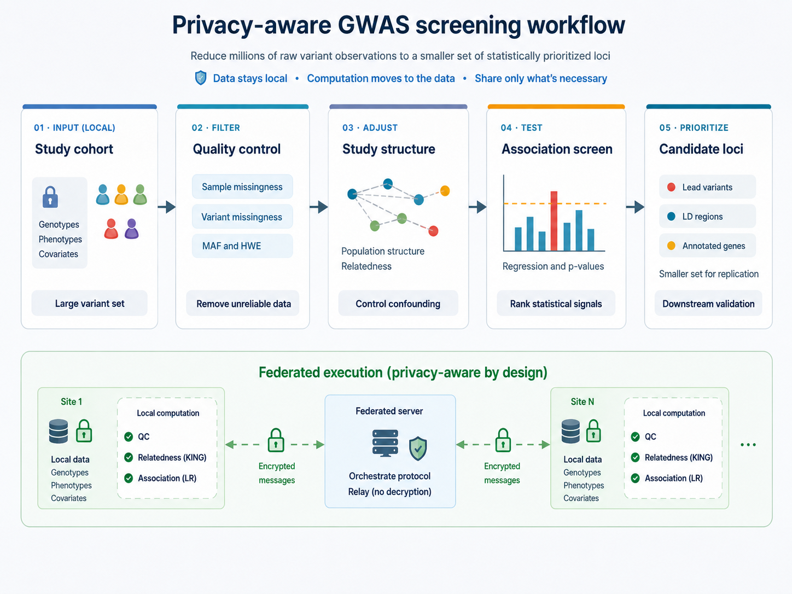
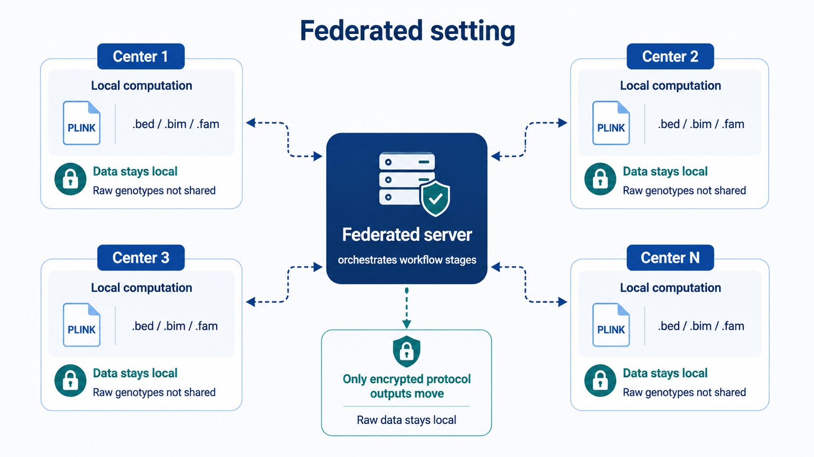

# FedGWAS Overview

FedGWAS is a lightweight federated pipeline for privacy-preserving GWAS screening across distributed genomic datasets. It supports federated quality control, KING-based relatedness screening, and logistic regression–based association screening within a client–server architecture, while keeping individual-level genotype data and genotype-level computations local to each participating institution.

Designed for reproducible analysis and deployment in data-restricted environments, FedGWAS minimizes the amount of information exchanged between clients and the coordinating server. Its modular architecture can be deployed without relying on a centralized web application, making it suitable for multi-institutional studies in which privacy, governance, legal, or operational requirements prevent the pooling of raw genomic data.



## Background

### GWAS screening

Genome-wide association studies (GWAS) evaluate genetic variants across the genome to identify variants associated with a trait or disease. Before association testing, samples and variants typically undergo quality control to remove unreliable data. Common procedures include filtering on genotype quality and missingness, checking allele frequencies and Hardy–Weinberg equilibrium, identifying population structure, and detecting duplicate or related individuals.

Depending on the study design, relatedness and population structure may be addressed through sample exclusion, covariate adjustment, or statistical models that account for genetic similarity. After association testing, variants can be filtered or prioritized according to statistical significance, linkage disequilibrium, genomic location, functional annotations, or other study-specific criteria. This reduces the number of loci requiring downstream validation or interpretation.

FedGWAS implements this **screening lifecycle**—harmonized quality control, relatedness screening, and association screening—not a complete GWAS study. Population stratification handling, continuous traits, richer covariates, and association models other than case–control logistic regression are not in the current protocol; they are future work.

GWAS associations are statistical signals and do not, by themselves, establish causality. Robust conclusions therefore depend on appropriate study design, rigorous quality control, suitable statistical models, and replication in independent cohorts. Larger and more diverse cohorts can improve statistical power and the generalizability of findings. However, many valuable genomic datasets remain distributed across institutions because legal, ethical, governance, privacy, or operational constraints prevent the central pooling of individual-level data.


Selected references:

- Uffelmann et al., [Genome-wide association studies](https://doi.org/10.1038/s43586-021-00056-9), *Nature Reviews Methods Primers*, 2021.
- Visscher et al., [10 years of GWAS discovery: biology, function, and translation](https://doi.org/10.1016/j.ajhg.2017.06.005), *American Journal of Human Genetics*, 2017.

### Federated setting

Federated learning enables institutions to collaborate by moving computation to the data rather than transferring data to a central location. In a federated GWAS screening workflow, each participating client retains its genotype and phenotype data locally, executes the agreed analysis stages within its own computing environment, and exchanges only the outputs required to coordinate the protocol. This approach supports multi-institutional analysis when legal, ethical, governance, privacy, or operational constraints make centralized data pooling impractical.



Federation alone does not guarantee privacy. Intermediate statistics, model outputs, and other exchanged artifacts may still reveal sensitive information if the protocol and threat model are not carefully designed. Federated systems may therefore incorporate additional safeguards, such as authenticated and encrypted transport, end-to-end encrypted client messaging, masking, or secure aggregation. The appropriate combination of protections depends on the sensitivity of the exchanged information, the assumed adversarial capabilities, and the computational and communication constraints of the deployment.

FedGWAS itself uses encryption, shuffling, anonymization, and lightweight secret-sharing. The coordinating server acts as a message relay and does not decrypt selected client-to-client payloads. These mechanisms provide practical protection against direct information leakage; they are not a complete privacy proof for every deployment threat model.


Selected federated-learning and federated-GWAS references:

- McMahan et al., [Communication-efficient learning of deep networks from decentralized data](https://proceedings.mlr.press/v54/mcmahan17a.html), *AISTATS*, 2017.
- Rieke et al., [The future of digital health with federated learning](https://doi.org/10.1038/s41746-020-00323-1), *npj Digital Medicine*, 2020.
- Nasirigerdeh et al., [sPLINK: a hybrid federated tool as a robust alternative to meta-analysis in genome-wide association studies](https://doi.org/10.1186/s13059-021-02562-1), *Genome Biology*, 2022.
- Wang et al., [Privacy-preserving federated genome-wide association studies via dynamic sampling](https://doi.org/10.1093/bioinformatics/btad639), *Bioinformatics*, 2023.
- Cho et al., [Secure and federated genome-wide association studies for biobank-scale datasets](https://doi.org/10.1038/s41588-025-02109-1), *Nature Genetics*, 2025.

## What the FedGWAS pipeline does

FedGWAS supports a complete screening lifecycle that encompasses federated
quality control, KING-based relatedness screening, and association screening,
while keeping all individual-level genotype data local to participating
institutions. It orchestrates these stages through Flower, executes genetics
operations with PLINK, and uses encryption so that selected protocol messages
can be forwarded by the server without being decrypted there.

In its current form, FedGWAS accepts client genotype data in PLINK 1.9 binary
format. VCF input is supported via conversion to PLINK-compatible
representations where configured. It applies federated quality control for
sample missingness, SNP missingness, minor allele frequency, and Hardy–Weinberg
equilibrium; performs KING-based relatedness screening; and runs local
logistic-regression filtering with privacy-preserving tokens, followed by
federated case–control association screening. Run outputs are organized into
per-client logs, intermediate files, result tables, and evaluation artifacts so
that multi-client experiments remain reproducible and inspectable.

The implementation is intended for multi-client screening experiments,
development of federated screening protocols, and deployment testing with real
Flower server and client processes.


## Quick Installation

FedGWAS is available on PyPI. Install it in a clean Python 3.11+ environment, and make sure PLINK 1.9 (`plink`) and PLINK 2 (`plink2`, for KING) are installed and discoverable on `PATH`:

```bash
python -m venv .venv
source .venv/bin/activate # or windows powershell .\.venv\Scripts\Activate.ps1
python -m pip install --upgrade pip
pip install FedGWAS
```

verify the installation:

```bash
python --version
fedgwas-sim --help
```

## Operating modes

FedGWAS supports two primary ways to run the same core pipeline.

### Simulation mode

Use simulation mode when you want to validate an installation, reproduce example
experiments, prepare configurations, or compare federated outputs against a
centralized baseline on one machine. The recommended entry point is the
`fedgwas-sim` command-line interface, which can initialize a study directory,
prepare synthetic example data, validate configuration, run Flower local
simulation, generate a centralized baseline, evaluate results, and collect output
artifacts.

Start with [Local Simulation](/get-started/local-simulation) for the guided
setup, or see [Simulation Mode](/user-guide/simulation) and the
[fedgwas-sim CLI](/user-guide/cli-simulation) for the full command reference.

### Deployment mode

Use deployment mode when the server and clients should run as separate Flower
processes, usually on separate machines, containers, or terminals. In this mode,
Flower SuperLink coordinates the federation and each SuperNode runs a client with
its own center configuration and local data paths. This is the closest
repository-supported workflow to a real multi-site deployment.

Start with [Federated Deployment](/get-started/federated-deployment). FedGWAS
provides two equivalent entry points: the `fedgwas-deploy` CLI and
`cluster_deployment/` scripts. See
[Installation and Overview](/user-guide/federated-deployment/installation)
for roles, ports, and checks.

## Start here

- [Prerequisites](/get-started/prerequisites): Install Python dependencies,
  Flower, and PLINK.
- [Local Simulation](/get-started/local-simulation): Run a complete local
  multi-client simulation.
- [Federated Deployment](/get-started/federated-deployment): Run FedGWAS with
  separate Flower server and client processes.
- [Configuration](/user-guide/configuration): Understand client (center) YAML
  settings and Flower run configuration.
- [Pipeline Workflow](/user-guide/design/workflow): Follow the four conceptual
  screening stages and the federated rounds that implement them.
- [Privacy and Masking](/user-guide/design/privacy-masking): Review the current privacy
  mechanisms and limitations.
- [Experiments](/user-guide/experiments): Explore shipped correctness, performance,
  and real-world experiment layouts.

## License

FedGWAS is distributed under the MIT License. See the repository
[LICENSE](https://github.com/idsla/Fed-GWAS/blob/main/LICENSE)
for the full license text.
