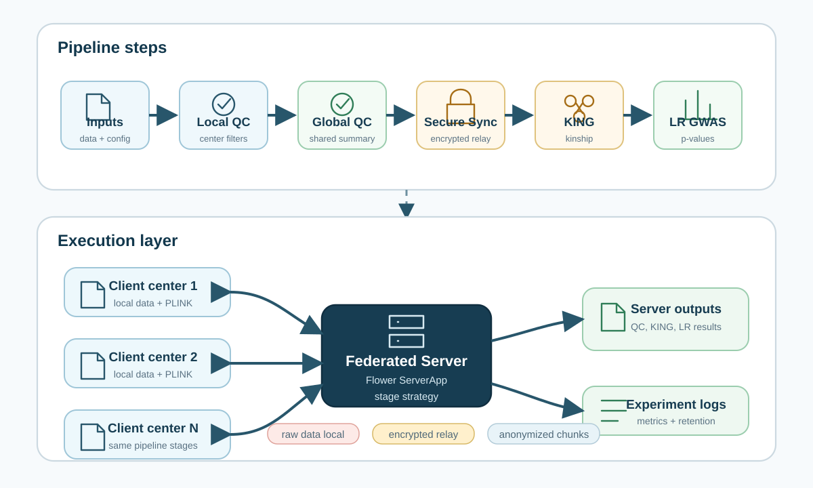
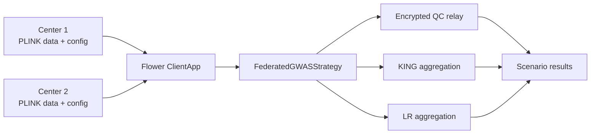

# Architecture

FedGWAS uses [Flower](https://flower.ai/) to coordinate a multi-client GWAS screening workflow. Each client keeps local genotype data and configuration. The server controls pipeline stages, distributes stage parameters, relays privacy-protected messages, and aggregates intermediate results.

Raw client datasets are not treated as a shared repository artifact. Cross-client operations rely on aggregate statistics, anonymized chunks, and the privacy mechanisms described in [Privacy and Masking](/user-guide/design/privacy-masking).

Selected references:

- Beutel et al., [Flower: A Friendly Federated Learning Research Framework](https://doi.org/10.48550/arXiv.2007.14390), *arXiv*, 2020.
- McMahan et al., [Communication-efficient learning of deep networks from decentralized data](https://proceedings.mlr.press/v54/mcmahan17a.html), *AISTATS*, 2017.



## Repository layout

```text
pipeline/
  client_app.py              # Flower ClientApp entry point
  server_app.py              # Flower ServerApp entry point
  clients/
    base_client.py           # Chunking, anonymization, PLINK calls
    data_loder.py            # YAML loading and Flower state restoration
    local_qc.py              # Local QC and local LR helpers
    iterative_king.py        # Iterative KING chunk sending
    iterative_lr.py          # Iterative LR chunk sending and result mapping
    client_qc_aggregator.py  # Client-side global QC aggregation after decrypting peer shares
    client_to_client.py      # ECDH + AES envelope helpers for server-relayed messages
    c2c_payloads.py          # Typed client-to-client payload encoding
    seed_sync.py             # Global seed persistence and encrypted seed synchronization
    lr_privacy.py            # Tokenized local LR filtering helpers
    logger_manager.py        # Per-client logging
  server/
    strategy_strict.py       # Current federated server strategy
    aggregator_king.py       # Server-side KING aggregation
    aggregator_lr.py         # Server-side LR aggregation
    prg_masking.py           # ECC key exchange helpers used by encrypted relay
  utils/
    monitoring_config.py     # Monitoring settings resolution
    retention_config.py      # Retention settings resolution
    performance/             # Runtime performance monitors and CSV merge helpers
experiments/
  correctness/tiny_even/     # Default tiny two-client validation experiment
  performance/               # Small/medium scalability layouts
  real_world/                # Real genotype experiment layouts
configs/
  config_template.yaml       # Center configuration template
docs/website/
  docusaurus.config.js       # Docusaurus site configuration
```

## Main components

| Component | Responsibility |
| --- | --- |
| Flower ClientApp | Creates `FedLRClient` instances for partitions and runs stage-specific client logic. |
| Flower ServerApp | Creates `FederatedGWASStrategy` and configures the number of server rounds. |
| `FederatedGWASStrategy` | Drives the strict stage machine, forwards encrypted client-to-client payloads, and calls KING/LR aggregators. |
| `DataLoader` | Reads center YAML, creates output directories, and restores config from Flower state. |
| PLINK | Performs dataset filtering, missingness checks, genotype counts, KING, and logistic regression. |
| Encrypted relay | Uses encryption so seed, QC, relatedness-map, and association-filtering payloads can be relayed by the server without server-side decryption. |
| Monitoring and retention | Writes per-node metrics and can prune non-essential outputs after successful completion. |

## Data flow


