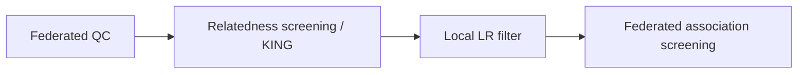

# GWAS Components

FedGWAS supports the main blocks of a typical case–control **GWAS screening** lifecycle: federated quality control, KING-based relatedness screening, and logistic-regression association screening. Genetics operations are executed locally with PLINK; participating clients keep raw genotypes on site.

For stage ordering, see [Workflow](/user-guide/design/workflow). For thresholds and chunk settings, see [Parameters](/user-guide/design/parameters).

## Supported screening components

| Component | Scope | What it screens / estimates |
| --- | --- | --- |
| Federated QC (sample) | Per client | Sample missingness (`--mind`) |
| Federated QC (variant) | Cross-client | SNP missingness, MAF, Hardy–Weinberg equilibrium |
| Relatedness screening | Cross-client | Pairwise kinship via KING |
| Association screening (local filter) | Per client, then shared filter | Local logistic-regression screen using privacy-preserving tokens to drop jointly insignificant SNPs |
| Association screening (federated test) | Cross-client | Case–control logistic regression |

## Federated quality control

- **Sample QC:** remove samples with high genotype missingness.
- **Variant QC:** remove SNPs that fail missingness, minor allele frequency (MAF), or Hardy–Weinberg equilibrium (HWE) thresholds agreed across clients.

Implementation stages are `local_qc` and `global_qc` / `global_qc_response`. See [Quality Control](/api-reference/modules/quality-control).

## Relatedness screening

- Estimate pairwise kinship with KING.
- Optionally filter related samples using `king_threshold`.

Implementation stages are `init_chunks` and `iterative_king`. See [KING / Kinship](/api-reference/modules/kinship).

## Association screening

- **Local filter:** each client runs local logistic regression and shares only privacy-preserving tokens for insignificant SNPs; clients then drop the shared insignificant set.
- **Federated association screening:** remaining variants are tested with case–control logistic regression across clients.

Current association screening is binary phenotypes via PLINK `--logistic`. Continuous traits, richer covariates, population stratification handling, and alternate association models are not covered yet.

## Related pages

- [Quality Control](/api-reference/modules/quality-control)
- [KING / Kinship](/api-reference/modules/kinship)
- [Association Screening](/api-reference/modules/association)
- [Privacy and Masking](/user-guide/design/privacy-masking)
