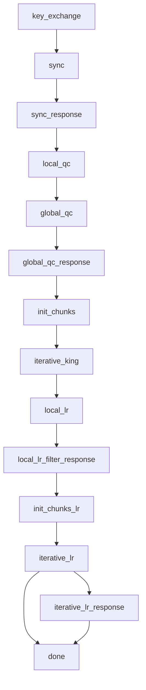

# Workflow

FedGWAS implements a four-stage GWAS screening lifecycle. These conceptual stages are realized as coordinated federated rounds. The server strategy sends a `stage` value in each Flower fit configuration. The client reads `config["stage"]`, runs the matching branch, and returns numpy arrays or empty parameters.

Logging, metrics, and production- versus research-oriented output retention run after screening completes. They are not screening stages.

## Conceptual screening stages

| Conceptual stage | What it does | Flower `stage` values |
| --- | --- | --- |
| 1. Privacy-preserving initialization | Clients generate local seeds, exchange encrypted seed shares via the server (relay only), and derive a shared global seed for chunking and identifier anonymization. | `key_exchange`, `sync`, `sync_response` |
| 2. Federated quality control | Local sample-level missingness filtering, then encrypted variant-level summaries so each client can apply harmonized MAF, missingness, and Hardy–Weinberg filters. | `local_qc`, `global_qc`, `global_qc_response` |
| 3. KING-based relatedness screening | Post-QC data are chunked and anonymized; the server computes kinship statistics on anonymized data; clients de-anonymize and accumulate kinship estimates. | `init_chunks`, `iterative_king` |
| 4. Federated association screening | Clients share privacy-preserving tokens for locally insignificant variants, then run federated case–control logistic regression on the remaining variants. | `local_lr`, `local_lr_filter_response`, `init_chunks_lr`, `iterative_lr`, `iterative_lr_response` |

## Flower stage overview

The table below is the implementation sequence. User-facing descriptions should use the conceptual names above.

| Order | Stage | Client action | Server action |
| --- | --- | --- | --- |
| 1 | `key_exchange` | Generate ECC keypair and send public key. | Collect public keys and check exchange completion. |
| 2 | `sync` | Receive peer public keys, encrypt seed messages for peers, and send ciphertext envelopes. | Forward encrypted seed messages without decrypting them. |
| 3 | `sync_response` | Decrypt peer seed messages and compute or persist the global seed. | Advance after clients have had a round to process forwarded seed messages. |
| 4 | `local_qc` | Run PLINK `--mind` to filter samples by missingness. | Acknowledge local QC and advance the workflow. |
| 5 | `global_qc` | Compute genotype counts, missingness counts, and thresholds; encrypt typed QC payloads for peers. | Forward encrypted QC messages without decrypting them. |
| 6 | `global_qc_response` | Decrypt peer QC payloads, compute the SNP exclusion list locally, and apply filtering. | Advance after clients have processed QC shares. |
| 7 | `init_chunks` | Receive chunk parameters and create chunks for KING. | Send chunk parameters. |
| 8 | `iterative_king` | Send one encoded PLINK chunk per call and process returned KING partials/maps. | Rebuild chunk files, merge data, run KING, and drain chunks until clients report done. |
| 9 | `local_lr` | Run local PLINK logistic regression and send tokenized insignificant SNPs. | Forward token arrays without resolving SNP identities. |
| 10 | `local_lr_filter_response` | Compute the token intersection locally and filter insignificant SNPs. | Advance after clients filter. |
| 11 | `init_chunks_lr` | Repartition filtered data for final LR. | Send LR chunk parameters. |
| 12 | `iterative_lr` | Send LR chunks and map returned p-values back to local SNP IDs when possible. | Merge chunks, run logistic regression, return p-values, and drain chunks until clients report done. |
| 13 | `iterative_lr_response` | Receive final LR results if the server has stored a last result payload. | Send final LR results and move to `done`. |

## State machine

## Encoded chunk format

`BaseGWASClient._read_chunk_as_array` serializes each PLINK chunk into one numpy array:

1. The first 12 bytes contain three `uint32` values: `bed_size`, `bim_size`, and `fam_size`.
2. The remaining bytes concatenate `bed_data + bim_data + fam_data`.
3. Server aggregators split the array by those recorded sizes and rebuild temporary PLINK files.

The same format is consumed by `aggregator_king.py` and `aggregator_lr.py`.
