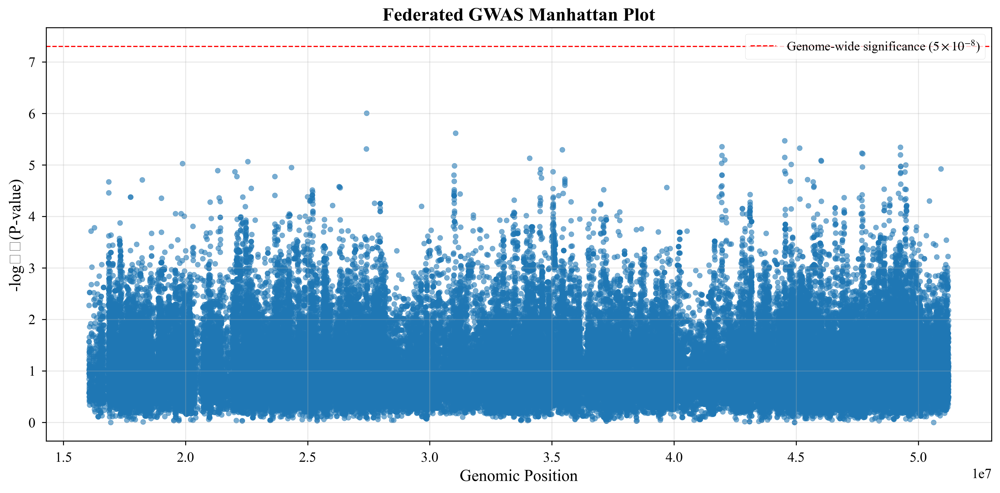

# Manuscript Materials for 1kGP Experiment

This directory contains all manuscript-ready materials generated from the 1000 Genomes Project (1kGP) federated GWAS experiment.

## Generated Materials

### Figures (`figures/`)
- **manhattan_federated.png**: Manhattan plot of federated GWAS results (high-resolution, 300 DPI)
- **manhattan_baseline.png**: Manhattan plot of centralized baseline results (high-resolution, 300 DPI)
- **qq_federated.png**: Q-Q plot of federated GWAS p-values
- **qq_baseline.png**: Q-Q plot of centralized baseline p-values
- **lr_correlation.png**: Correlation plot comparing federated vs centralized p-values (if available)

### Tables (`tables/`)
- **qc_table.md**: Quality control agreement metrics (Markdown format)
- **qc_table.tex**: Quality control agreement metrics (LaTeX format)
- **lr_table.md**: Logistic regression correlation metrics (Markdown format)
- **king_table.md**: KING kinship estimation metrics (Markdown format)

### Text (`manuscript_sections.md`)
Complete manuscript text sections including:
- **Dataset and Experimental Setup**: Description of the 1kGP dataset, population partitioning, and experimental configuration
- **Results**: Detailed results for QC agreement, KING kinship estimation, and logistic regression analysis

## Usage

### For LaTeX Manuscript
1. Include figures using:
   ```latex
   \includegraphics[width=\textwidth]{figures/manhattan_federated.png}
   ```

2. Include tables using:
   ```latex
   \input{tables/qc_table.tex}
   ```

3. Copy relevant sections from `manuscript_sections.md` into your manuscript

### For Markdown/Word Manuscript
1. Reference figures using:
   ```markdown
   
   ```

2. Include tables directly from the `.md` files

3. Copy sections from `manuscript_sections.md`

## Experiment Details

- **Dataset**: 1000 Genomes Project Phase 3, Chromosome 22
- **Samples**: 2,504 individuals
- **Partitioning**: By population (EUR vs AFR)
- **Phenotype Model**: Population-stratified logistic model, causal fraction = 0.01
- **Baseline**: Centralized PLINK analysis
- **Framework**: Flower federated learning

## Key Results Summary

- **QC Agreement**: F1 = 0.9991, Precision = 1.0000, Recall = 0.9983
- **KING Correlation**: Pearson r = 0.9981, MAE = 0.004717
- **Global LR Correlation**: Pearson r = 0.6960, Top-100 overlap = 64.0%

## Regenerating Materials

To regenerate these materials with updated results:

```bash
python experiments/tools/generate_manuscript_materials.py \
    experiments/real_world/1000genomes/results \
    --baseline experiments/real_world/1000genomes/data/centralized_baseline \
    --output experiments/real_world/1000genomes/manuscript
```

## Notes

- All figures are generated at 300 DPI for publication quality
- Tables are available in both Markdown and LaTeX formats
- The manuscript text includes proper citations (update citation keys as needed)
- All numerical values are automatically extracted from evaluation reports
