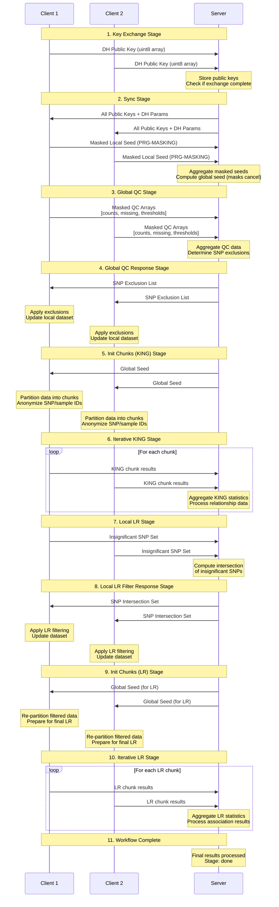
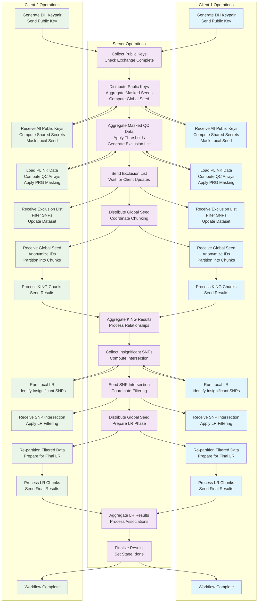

# Documentation Note

## Requirements

### Set up the environment

```bash
pip install -r requirements.txt
```

### Download Plink

```bash
wget https://www.cog-genomics.org/plink/download/plink2.zip
unzip plink2.zip
```

## Run the Pipeline

### CLient Side

```bash
source venv/bin/activate
python main_client.py
```

### Server Side

```bash
source venv/bin/activate
python main_server.py
```

## Workflow Sequence Diagram



## Detailed Workflow Swimlane Diagram



### Stage-by-Stage Operations Summary

**Stage 1 - Key Exchange:**
- *Clients*: Generate DH keypairs using server parameters, send public keys as uint8 arrays
- *Server*: Distribute DH parameters, collect and store client public keys, check completion

**Stage 2 - Sync:**
- *Clients*: Receive all public keys, compute shared secrets, apply PRG masking to local seeds
- *Server*: Distribute public keys, aggregate masked seeds (masks cancel out), compute global seed

**Stage 3 - Global QC:**
- *Clients*: Load PLINK data, compute genotype/missing counts, apply PRG masking to QC arrays
- *Server*: Aggregate masked QC data, apply thresholds (MAF, missing rate, HWE), generate exclusion list

**Stage 4 - Global QC Response:**
- *Clients*: Receive SNP exclusion list, filter local datasets, update PLINK files
- *Server*: Send exclusion list to all participating clients

**Stage 5 - Init Chunks (KING):**
- *Clients*: Receive global seed, anonymize SNP/sample IDs, partition data into chunks
- *Server*: Distribute global seed for deterministic shuffling

**Stage 6 - Iterative KING:**
- *Clients*: Process each chunk for kinship analysis, send results iteratively
- *Server*: Aggregate KING statistics, process relationship data

**Stage 7 - Local LR:**
- *Clients*: Run local logistic regression, identify insignificant SNPs (p > threshold)
- *Server*: Collect insignificant SNP sets, compute intersection across clients

**Stage 8 - Local LR Filter Response:**
- *Clients*: Receive SNP intersection, apply filtering to remove insignificant SNPs
- *Server*: Send intersection of insignificant SNPs to all clients

**Stage 9 - Init Chunks (LR):**
- *Clients*: Re-partition filtered datasets, prepare for final LR analysis
- *Server*: Distribute global seed for LR phase chunking

**Stage 10 - Iterative LR:**
- *Clients*: Process LR chunks, send final association results
- *Server*: Aggregate final LR statistics, process association results

**Stage 11 - Complete:**
- *Clients*: Workflow finished, final results processed
- *Server*: Set stage to "done", finalize all results

